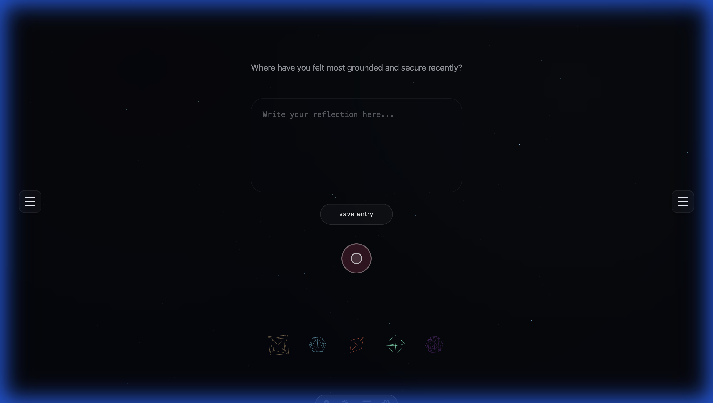

# ELEMENTA Prototype (Astro)

ELEMENTA is a browser-based reflective journaling experience inspired by the five classical elements. Each element drives a distinct set of prompts, 3D geometry, and visual accents to encourage different emotional and mental states, while local storage keeps reflections handy between sessions.

This project has been migrated from a vanilla JS prototype to **Astro**.

## Project Layout

The active project code lives in the `Elementa/` directory.

```
Elementa/
├── public/             # Static assets
├── src/
│   ├── components/     # Astro components
│   ├── layouts/        # Page layouts
│   ├── pages/          # Routing
│   ├── styles/         # Global CSS
│   └── lib/            # Core logic (migrated from vanilla)
│       ├── app/        # Application orchestration
│       ├── core/       # Pure domain logic
│       ├── infra/      # Infrastructure (Storage, Audio)
│       └── ui/         # User Interface & 3D (Three.js)
├── astro.config.mjs    # Astro configuration
└── package.json        # Dependencies
```

## Element Breakdown

| Element    | Geometry     | Color Tone       | Prompt Focus                              |
| ---------- | ------------ | ---------------- | ----------------------------------------- |
| **Earth**  | Cube         | Warm ochre/brown | Grounding, physical sensations, stability |
| **Water**  | Icosahedron  | Deep teal/blue   | Emotional flow, release, flexibility      |
| **Fire**   | Tetrahedron  | Ember orange/red | Passion, action, creative spark           |
| **Air**    | Octahedron   | Muted sky tones  | Clarity, thoughts, mental spaciousness    |
| **Spirit** | Dodecahedron | Ethereal violet  | Connection, gratitude, soulful awareness  |

Each element page pairs its geometry with a rotating THREE.js mesh, a contextual prompt, and tinted UI touches to reinforce the intended mood.

## Running Locally

1. **Navigate to the project directory:**

   ```bash
   cd Elementa
   ```

2. **Install dependencies:**

   ```bash
   npm install
   ```

3. **Start the dev server:**

   ```bash
   npm run dev
   ```

4. Open the printed localhost URL in your browser.



## Tech Stack

- **Framework**: [Astro](https://astro.build)
- **3D Graphics**: [Three.js](https://threejs.org)
- **Styling**: Vanilla CSS (Global)
- **State/Storage**: LocalStorage API

## Future Roadmap

- **Authentication**: Integration with **Discord** and **Gmail** to sync journals across devices.
- **Elemental Audio**: Immersive ambient soundscapes for each element to deepen the reflective state.
- **Enhanced UX**: Refined micro-interactions, smoother transitions, and more intuitive controls.

---

Crafted with mindfulness and geometry ✨
